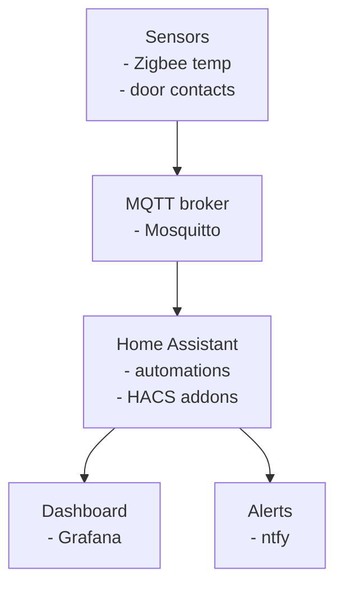

# Home lab v2 (12/3/2026)

```mermaid
flowchart TD
    SEN["Sensors<br>- Zigbee temp<br>- door contacts"]
    MQTT["MQTT broker<br>- Mosquitto"]
    HA["Home Assistant<br>- automations<br>- HACS addons"]
    DASH["Dashboard<br>- Grafana"]
    ALR["Alerts<br>- ntfy"]

    SEN --> MQTT
    MQTT --> HA
    HA --> DASH
    HA --> ALR
```

- HA OS - needs RPi 4 or NUC, SD card not reliable for DB
- Grafana - musí mít **InfluxDB** jako zdroj
  - → `docker compose up -d`
